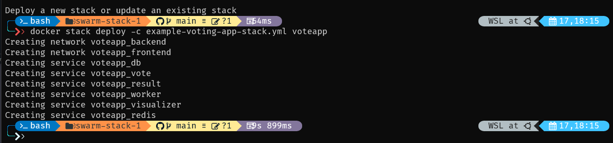

# Docker Swarm Stack for Example Voting App
This is part of lecture explaining docker stack configuration, explaining how docker service gets to complicated (espesically for large projects), thus yaml was created for service called stacks. The Docker Swarm stack configuration for deploying the Example Voting App, a multi-service application that demonstrates a typical microservices architecture. The stack is defined using a Docker Compose file in version 3.9 format. (ref: https://github.com/RaymondSWE/example-voting-app).

- **Redis:** In-memory key-value store, used as a caching layer by the voting app. Configured with 1 replica.
- **Database (db):** PostgreSQL database, used for storing votes. Persistent data is stored in the `db-data` volume. Runs only on manager nodes due to `constraints`.
- **Voting App (vote):** Frontend application for voting. Exposes port 5000 and communicates with Redis.
- **Result App (result):** Shows voting results. Exposes port 5001 and connects to the PostgreSQL database.
- **Worker:** Backend service that processes votes from Redis and updates the database.
- **Visualizer:** A utility service for visualizing the Docker Swarm state. Exposes port 8080.

## Networks
Two overlay networks are defined:
- **frontend:** Used by services that need to be accessible or communicate with external clients.
- **backend:** For internal communication between services, enhancing security and network segmentation.

## Volumes
- **db-data:** A persistent volume for the PostgreSQL database, ensuring data is not lost when the container is restarted or moved to another node.

## Deployment Configurations
- **replicas:** Specifies the number of instances for each service.
- **update_config:** Defines how updates to the service are rolled out.
- **restart_policy:** Outlines the policy for restarting containers if they fail.
- **placement:** Determines where services are placed within the swarm, with constraints like `node.role == manager`.
- **depends_on:** Specifies dependencies between services.
- **labels:** Used for labeling services, useful for organization and filtering.

